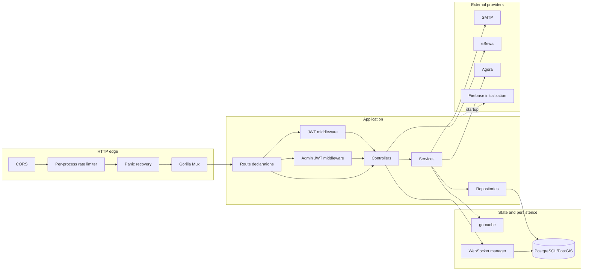
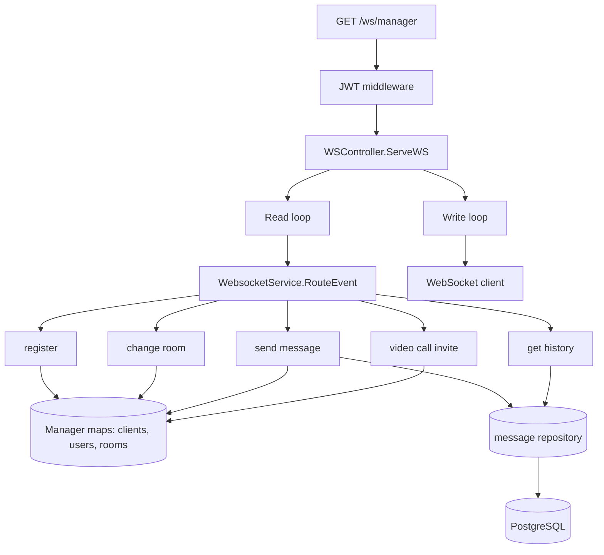
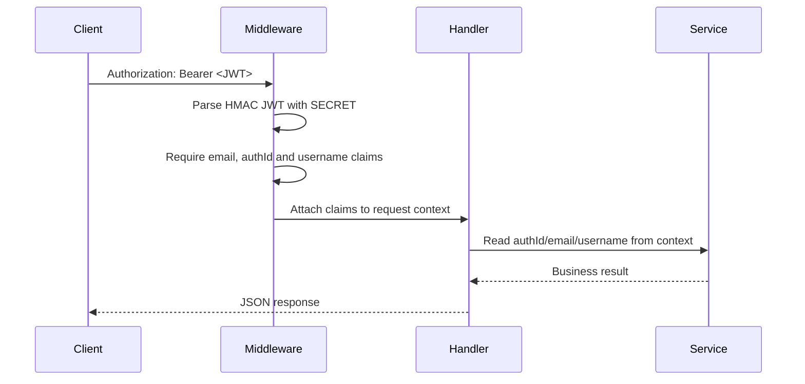
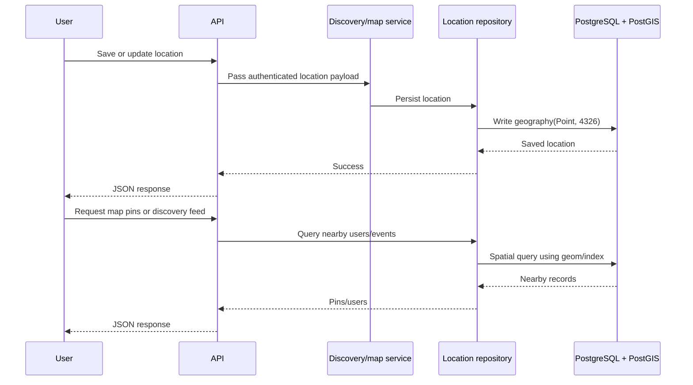

# ComeToSee Backend Architecture

This document expands the diagrams in the root [README](../README.md). It is based on the current implementation in `main.go`, `routes/`, `controller/`, `service/`, `repository/`, `middleware/`, and `intailizer/migrations/`.

## Component boundaries

## WebSocket event routing

## Authentication sequence

Admin middleware follows the same pattern with `ADMIN_SECRET` fallback to `SECRET`, then requires `role == "admin"` and attaches `adminId` and `adminEmail`.

## Data flow for geographic discovery

## Notes for future changes

- Keep route protection explicit and document any newly public endpoint.
- Prefer typed context keys for JWT claims to avoid collisions.
- Move process-local OTP, cache, rate-limit, and WebSocket coordination to shared infrastructure when scaling beyond one instance.
- Keep credentials outside the repository and rotate exposed values before deployment.
